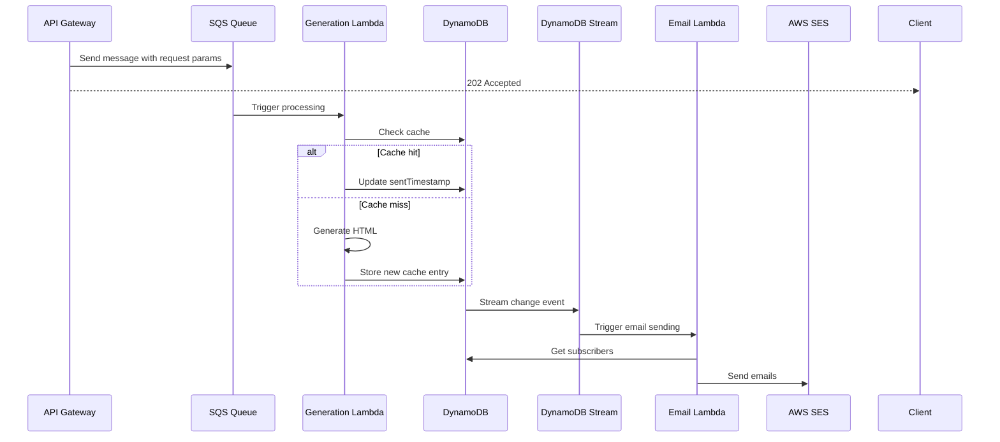

# Story 10: Cache HTML in DynamoDB & Async Optimization

## Story

**As a** system architect\
**I want** to implement HTML caching and asynchronous processing with DynamoDB\
**so that** we can optimize performance and handle long-running LLM operations efficiently.

## Status

Draft

## Context

Currently, our system processes HN summaries synchronously within API Gateway timeouts. To improve scalability and user experience, we need to:

1. Cache generated HTML summaries in DynamoDB
2. Move processing to an async Lambda via SQS
3. Use DynamoDB Streams to trigger email sending
   This allows for longer LLM processing times and better resource utilization.

## Estimation

Story Points: 3

## Acceptance Criteria

1. - [ ] DynamoDB table updated with new caching schema
2. - [ ] SQS queue created for async processing
3. - [ ] Lambda function implemented for HTML generation with 10-minute timeout
4. - [ ] DynamoDB Stream trigger implemented for email sending
5. - [ ] Cache invalidation after 3 hours implemented
6. - [ ] All IAM roles and policies configured correctly
7. - [ ] E2E tests passing for the entire flow

## Subtasks

1. - [ ] DynamoDB Schema Updates

   1. - [ ] Add new composite key schema for HTML caching
   2. - [ ] Enable DynamoDB Streams
   3. - [ ] Update CDK stack with new table configuration

2. - [ ] SQS Implementation

   1. - [ ] Create SQS queue in CDK
   2. - [ ] Configure dead letter queue
   3. - [ ] Set up IAM roles for Lambda to SQS access

3. - [ ] Lambda Functions

   1. - [ ] Create HTML generation Lambda
   2. - [ ] Create email trigger Lambda
   3. - [ ] Configure timeouts and memory settings

4. - [ ] IAM & Security

   1. - [ ] Configure Lambda execution roles
   2. - [ ] Set up DynamoDB access policies
   3. - [ ] Configure SQS access policies

5. - [ ] Testing
   1. - [ ] Unit tests for cache logic
   2. - [ ] Integration tests for async flow
   3. - [ ] E2E tests for complete pipeline

## Constraints

- Must use existing DynamoDB table
- Lambda processing timeout: 10 minutes
- Email sending Lambda timeout: 2 minutes
- Cache TTL: 3 hours
- Ensure when getting emails it ignores rows with SK that start with `SUMMARY::`

## Dev Notes

### DynamoDB Schema

```typescript
interface CacheEntry {
  PK: string; // 'sub:hakdaily'
  SK: string; // 'SUMMARY::DATE::<mmddyyyy>::<postCount>::<articleCount>::<commentCount>'
  html: string; // The cached HTML content
  sentTimestamp: number; // Last time the content was sent
  createdAt: number; // When the cache entry was created
  ttl: number; // TTL for cache invalidation (3 hours from creation)
}
```

### IAM Roles & Policies Required

1. HTML Generation Lambda Role:

   - DynamoDB: Read/Write to cache table
   - SQS: Receive/Delete messages
   - CloudWatch: Logs
   - LLM API: Access to configured endpoint

2. Email Trigger Lambda Role:
   - DynamoDB: Read stream
   - SES: Send emails
   - CloudWatch: Logs
   - DynamoDB: Read subscription table

### Architecture Flow



## Progress Notes As Needed
