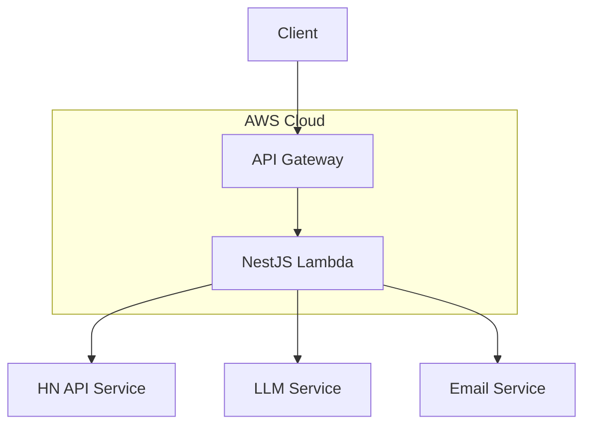

# Hakata34 - Code Kata for Agentic Driven Development: AI-Powered Hacker News Digest Service

[](https://github.com/bmadcode/hakata34) Current Version 1.0 Feature Complete and frozen.

This repository remains a valuable reference for the AIADD (Ai Agentic Driven Development - AKA BMad Workflow) and serves as a foundation for the optimized V2.0 implementation. For it to function, ensure you have the cursor option on to use .cursorrules file in the root of the project, or add the bulk of it to your cursor settings.

You can view a .ai folder that has the prd. that drove the AI to produce each story in that folder and implement them each 1 at a time. Each numbered story is only created in that folder by the AI after the previous we agree is complete. This magic happens due to the .cursorrules file in the root of the project. The current best model in cursor for this is Claude 3.5 Sonnet. Others are still to wonky to reliable create and modify the story md files against the proper template, and also just generally do not follow our agreed upon working model.

TL;DR:

If you would like to try this out, clone the repo and delete everything aside from, jump in to Composer Agent mode, and have fun:

- .ai/prd.md
- .cursorrules
- .cursor/rules/story-template.mdc
- .cursor/rules/\*.mdc (recommended)

### The AI Agentic Driven Development (AiADD) Workflow

This project implements the AIADD (PRD Story) Workflow - a systematic approach to software development using AI:

1. **Detailed PRD Creation**: Comprehensive documentation of requirements, architecture, and technical decisions, AC, and tasks
2. **Story-Based Development**: Breaking down the project into manageable stories
3. **AI-Driven Implementation**: Step-by-step development with AI assistance
4. **Human-AI Collaboration**: Driver (human) approval and guidance throughout the process

### AIADD Workflow Best Practices

- The PRD and its task breakdown is key to success with this method and workflow.
- You can always append new high level stories to the PRD.
- Modify the Tech Stack, Deployment Infra and tooling etc as needed in the PRD along with project constraints for it to take into account when it creates a story file on its own.
- Due to the rules in the .cursorrules file, the AI when in agent mode will know to figure out:
  - What is the first or next story to plan
  - Create a draft plan of the story calling it something like story-1.story.md
  - Will wait for your review of the file before starting to implement that stories subtasks
  - Will sometimes work in a TDD fashion, but sometimes will need reminding.
- Once the story is created, you can tell the AI to begin implementing it.
- If the AI does not, have it occasionally update the story file with progress by asking it to.
- After working for a while through subtasks completion, or full story completion, once the story has been updated by the AI, it is best to start a new chat (especially fresh when about to start a new story)

Here is how I like to work with it / sample prompts:
New Chat Window: Mr Data, please set course for our new mission!

- Data will recognize if the current story is still in progress, create a new story from the next prd task, or suggest otherwise - in agent mode with claud, it should work very fluidly and not need a lot of instruction to know what to do next.

New or Existing Chat Window: Red Alert Data! Ships Computer shows an Anomaly - Engage all Tests!

- Agent will run all unit tests, and will continue to fix failures until all test pass (generally) - this is fun in YOLO mode - go away come back and all might be green. But pay attention to what the AI did to 'make it green' or you might have a bigger mess on your hands unnoticed until later.

New Chat Window: Data - Lets get to work!

- Agent (Mr Data) will know if you are in the middle of a story, or if the story is complete and you are ready to start a new one.

Good luck - the idea with the KATA of doing this is to see how far you can get with the AI as the driver and you as the Project Manager, Coach, Commander of the Starship Enterprise and a Senior Technical Advisor / Lead..

#### Key Components:

- `.ai/` folder: Maintains story history and memory across chat sessions
- `.cursorrules`: Defines collaboration protocols between human and AI
- `.cursor/rules/story-template.mdc`: Standardized format for task breakdown and tracking
- `.cursor/rules/`: rules for the AI agent in multiple small files targeting file glob patterns

## Table of Contents

- [Hakata34 - Code Kata for Agentic Driven Development: AI-Powered Hacker News Digest Service](#hakata34---code-kata-for-agentic-driven-development-ai-powered-hacker-news-digest-service)
  - [The AI Agentic Driven Development (AiADD) Workflow](#the-ai-agentic-driven-development-aiadd-workflow)
  - [AIADD Workflow Best Practices](#aiadd-workflow-best-practices)
    - [Key Components:](#key-components)
  - [Table of Contents](#table-of-contents)
  - [⚠️ Important Project Update](#️-important-project-update)
  - [Project Overview](#project-overview)
  - [Features](#features)
  - [HAKATA - HackerNews AI Agent KATA](#hakata---hackernews-ai-agent-kata)
    - [What is a Kata?](#what-is-a-kata)
  - [Project Progress](#project-progress)
  - [Technologies Used](#technologies-used)
    - [Core Technologies](#core-technologies)
    - [AWS Services (Free Tier)](#aws-services-free-tier)
    - [Testing \& Quality](#testing--quality)
    - [AI \& Utilities](#ai--utilities)
  - [API Documentation](#api-documentation)
    - [Endpoints](#endpoints)
    - [Example Response](#example-response)
  - [Getting Started](#getting-started)
    - [Prerequisites](#prerequisites)
    - [Environment Variables](#environment-variables)
    - [Installation](#installation)
    - [Available Commands](#available-commands)
      - [Development Commands](#development-commands)
      - [Story Summarization Commands](#story-summarization-commands)
      - [Deployment Commands](#deployment-commands)
  - [Architecture](#architecture)
    - [System Overview](#system-overview)
    - [Key Components](#key-components-1)
  - [Contributing](#contributing)
    - [Development Process](#development-process)
    - [Code Style](#code-style)
    - [Documentation](#documentation)
  - [License](#license)

## ⚠️ Important Project Update

**Project Status**: This repository has been frozen at Story 9, and Story 10 will not be implemented. Based on our learnings about the async architecture and optimal route structure, we are initiating a Version 2.0 of the project that will achieve the same end-state more efficiently.

The new project will leverage our enhanced understanding of:

- Asynchronous processing requirements of LLM and story retrieval and 30 second timeout of api gateway
- Optimal API route design
- DynamoDB caching strategies
- Background processing patterns

🔗 **V2.0 Project Link**: [Coming Soon]

## Project Overview

HakNews is an intelligent news digest service that delivers curated summaries of top Hacker News stories and discussions directly to your inbox. The service leverages AI to provide concise, meaningful summaries of both articles and community discussions, helping tech professionals stay informed without information overload.

## Features

- Fetch top stories from Hacker News with comments
- AI-powered summarization of articles and comments
- Configurable number of stories and comments
- Rate limiting and caching for optimal performance
- Comprehensive error handling
- Type-safe API with OpenAPI/Swagger documentation

## HAKATA - HackerNews AI Agent KATA

This repository serves as an exercise in the Agentic AI IDE Workflow Kata (HAKATA).

### What is a Kata?

The term "kata" (型 or 形) originates from Japanese martial arts, referring to detailed choreographed patterns of movements practiced either solo or in pairs. In software development, a kata is a coding exercise that developers practice repeatedly to hone their skills, improve muscle memory, and master specific techniques or patterns.

## Project Progress

| Phase                   | Status      | Description                                               |
| ----------------------- | ----------- | --------------------------------------------------------- |
| ✅ Project Setup        | Complete    | Repository initialization and basic configuration         |
| ✅ NestJS Configuration | Complete    | Setting up NestJS framework and initial project structure |
| ✅ HN API Integration   | Complete    | Implementing Hacker News API integration                  |
| ✅ AWS Infrastructure   | Complete    | Setting up AWS CDK and required services                  |
| ✅ Testing Framework    | Complete    | Implementing comprehensive testing strategy               |
| ✅ LLM Integration      | Complete    | Adding AI summarization capabilities                      |
| 🚧 Email Service        | In Progress | Implementing email delivery system                        |
| ✅ Production Deploy    | Complete    | Final deployment and production setup                     |

## Technologies Used

### Core Technologies

- **Runtime**: Node.js 22
- **Language**: TypeScript
- **Framework**: NestJS
- **Cloud Infrastructure**: AWS CDK

### AWS Services (Free Tier)

- Lambda (Serverless Functions)
- API Gateway (REST API Management)
- CloudWatch (Monitoring)

### Testing & Quality

- Jest (Unit Testing)
- Playwright (E2E Testing)
- ESLint & Prettier (Code Quality)

### AI & Utilities

- DeepSeek Chat (LLM Integration)
- Nodemailer (Email Service)
- Zod (Schema Validation)

## API Documentation

### Endpoints

The API has been streamlined to focus on core functionality:

```
POST /api/v1/hacker-news/summarized-stories
```

This endpoint fetches and summarizes Hacker News stories and their comments. Parameters:

- `numStories`: Number of top stories to fetch (default: 10)
- `numCommentsPerStory`: Number of comments to summarize per story (default: 20)
- `maxSummaryLength`: Maximum length of each summary in characters (default: 300)

### Example Response

```json
{
  "stories": [
    {
      "id": 123456,
      "title": "Example Story Title",
      "url": "https://example.com/story",
      "score": 100,
      "by": "user123",
      "time": 1647123456,
      "descendants": 50,
      "articleSummary": {
        "summary": "Concise summary of the article content...",
        "summaryGeneratedAt": "2024-03-21T12:34:56Z",
        "tokenCount": 150
      },
      "commentsSummary": {
        "summary": "Overview of the discussion...",
        "summaryGeneratedAt": "2024-03-21T12:34:57Z",
        "tokenCount": 200
      }
    }
  ],
  "meta": {
    "fetchedAt": "2024-03-21T12:34:58Z",
    "processingTimeMs": 2500,
    "storiesRetrieved": 1,
    "totalCommentsRetrieved": 5,
    "totalTokensUsed": 350
  }
}
```

## Getting Started

### Prerequisites

- Node.js 22 or higher
- npm or yarn
- AWS Account (for production deployment)
- Gmail account (for email service)

### Environment Variables

Copy `.env.example` to `.env.local` for local development or `.env.production` for production:

```bash
# Required Environment Variables
NODE_ENV=development|production

# LLM Configuration
LLM_API_KEY=your-deepseek-api-key
LLM_API_ENDPOINT=https://api.deepseek.com/v1/chat/completions
LLM_MODEL=deepseek-chat
LLM_BASE_URL=https://api.deepseek.com
LLM_MAX_TOKENS=500
LLM_TEMPERATURE=0.7
LLM_RATE_LIMIT_PER_MINUTE=60

# Email Configuration (if using email features)
SMTP_HOST=smtp.gmail.com
SMTP_PORT=587
SMTP_USER=your-email@gmail.com
SMTP_PASS=your-app-specific-password
TEST_EMAIL_RECIPIENTS=comma,separated,email,list

# Production API Configuration
API_URL=your-api-gateway-url
API_KEY=your-api-gateway-key
```

### Installation

1. Clone the repository

```bash
git clone https://github.com/yourusername/haknews.git
cd haknews
```

2. Install dependencies

```bash
npm install
```

3. Start the development server

```bash
npm run dev              # Start development server
npm run dev:restart      # Kill port 3000 and restart server
```

### Available Commands

#### Development Commands

```bash
# Start development server
npm run dev              # Start development server
npm run dev:restart      # Kill port 3000 and restart server

# Run tests
npm run test                 # Unit tests
npm run test:e2e            # End-to-end tests
npm run test:e2e:ui         # E2E tests with UI
npm run test:e2e:prod       # E2E tests against production
```

#### Story Summarization Commands

```bash
# Local development
npm run summarize           # Summarize stories from local server

# Production environment
npm run summarize:prod              # Default: 10 stories, 20 comments, 300 chars
npm run summarize:prod:quick        # Quick overview: 3 stories, 5 comments, 200 chars
npm run summarize:prod:detailed     # Detailed view: 5 stories, 20 comments, 500 chars

# Custom parameters
npm run summarize:prod -- <numStories> <numCommentsPerStory> <maxSummaryLength>
Example: npm run summarize:prod -- 5 10 250

# Show help
npm run summarize:prod -- --help
```

#### Deployment Commands

```bash
npm run deploy             # Deploy to AWS
npm run diff               # Show infrastructure changes
```

## Architecture

### System Overview



### Key Components

1. **API Layer**

   - NestJS REST API
   - AWS API Gateway with API Key authentication
   - Request/Response validation using Zod

2. **Core Services**

   - Hacker News API Integration
   - LLM-powered summarization
   - Email delivery system

3. **Infrastructure**
   - AWS CDK for IaC
   - Lambda for serverless compute
   - CloudWatch for monitoring

## Contributing

We welcome contributions to HakNews! This project follows Test-Driven Development (TDD) practices and emphasizes code quality.

### Development Process

1. Fork the repository
2. Create a feature branch (`git checkout -b feature/amazing-feature`)
3. Write tests first (TDD approach)
4. Implement your changes
5. Ensure all tests pass
6. Submit a Pull Request

### Code Style

- Follow TypeScript best practices
- Use ESLint and Prettier for code formatting
- Maintain test coverage above 80%
- Follow conventional commit messages

### Documentation

- Update README.md for significant changes
- Document new features in the `.ai/prd.md` file
- Include relevant Mermaid diagrams for architectural changes

## License

This project is licensed under the MIT License - see below for details:

```text
MIT License

Copyright (c) 2024 HakNews

Permission is hereby granted, free of charge, to any person obtaining a copy
of this software and associated documentation files (the "Software"), to deal
in the Software without restriction, including without limitation the rights
to use, copy, modify, merge, publish, distribute, sublicense, and/or sell
copies of the Software, and to permit persons to whom the Software is
furnished to do so, subject to the following conditions:

The above copyright notice and this permission notice shall be included in all
copies or substantial portions of the Software.

THE SOFTWARE IS PROVIDED "AS IS", WITHOUT WARRANTY OF ANY KIND, EXPRESS OR
IMPLIED, INCLUDING BUT NOT LIMITED TO THE WARRANTIES OF MERCHANTABILITY,
FITNESS FOR A PARTICULAR PURPOSE AND NONINFRINGEMENT. IN NO EVENT SHALL THE
AUTHORS OR COPYRIGHT HOLDERS BE LIABLE FOR ANY CLAIM, DAMAGES OR OTHER
LIABILITY, WHETHER IN AN ACTION OF CONTRACT, TORT OR OTHERWISE, ARISING FROM,
OUT OF OR IN CONNECTION WITH THE SOFTWARE OR THE USE OR OTHER DEALINGS IN THE
SOFTWARE.
```
