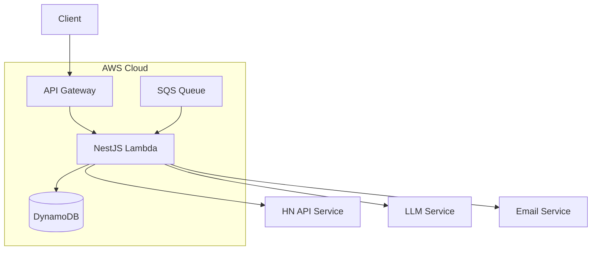

# HakNews - AI-Powered Hacker News Digest Service

[](https://github.com/yourusername/haknews)

## Table of Contents

- [HakNews - AI-Powered Hacker News Digest Service](#haknews---ai-powered-hacker-news-digest-service)
  - [Table of Contents](#table-of-contents)
  - [Project Overview](#project-overview)
  - [HAKATA - HackerNews AI Agent KATA](#hakata---hackernews-ai-agent-kata)
    - [What is a Kata?](#what-is-a-kata)
    - [The AI Agentic PRD Story Workflow](#the-ai-agentic-prd-story-workflow)
      - [Key Components:](#key-components)
    - [Best Practices](#best-practices)
  - [Project Progress](#project-progress)
  - [Technologies Used](#technologies-used)
    - [Core Technologies](#core-technologies)
    - [AWS Services (Free Tier)](#aws-services-free-tier)
    - [Testing \& Quality](#testing--quality)
    - [AI \& Utilities](#ai--utilities)
  - [Getting Started](#getting-started)
    - [Prerequisites](#prerequisites)
    - [Local Development Setup](#local-development-setup)
    - [Running Tests](#running-tests)
  - [Architecture](#architecture)
    - [System Overview](#system-overview)
    - [Key Components](#key-components-1)
  - [Contributing](#contributing)
    - [Development Process](#development-process)
    - [Code Style](#code-style)
    - [Documentation](#documentation)
  - [License](#license)

## Project Overview

HakNews is an intelligent news digest service that delivers curated summaries of top Hacker News stories and discussions directly to your inbox. The service leverages AI to provide concise, meaningful summaries of both articles and community discussions, helping tech professionals stay informed without information overload.

## HAKATA - HackerNews AI Agent KATA

This repository serves as an exercise in the Agentic AI IDE Workflow Kata (HAKATA).

### What is a Kata?

The term "kata" (型 or 形) originates from Japanese martial arts, referring to detailed choreographed patterns of movements practiced either solo or in pairs. In software development, a kata is a coding exercise that developers practice repeatedly to hone their skills, improve muscle memory, and master specific techniques or patterns.

### The AI Agentic PRD Story Workflow

This project implements the AIA gentic PRD Story Workflow - a systematic approach to software development using AI agents:

1. **Detailed PRD Creation**: Comprehensive documentation of requirements, architecture, and technical decisions, AC, and tasks
2. **Story-Based Development**: Breaking down the project into manageable stories
3. **AI-Driven Implementation**: Step-by-step development with AI assistance
4. **Human-AI Collaboration**: Driver (human) approval and guidance throughout the process

#### Key Components:

- `.ai/` folder: Maintains story history and memory across chat sessions
- `working-rules.mdc`: Defines collaboration protocols between human and AI
- Story templates: Standardized format for task breakdown and tracking

### Best Practices

_(To be expanded)_

- Work in small, granular tasks
- Ensure detailed task specifications to reduce ambiguity
- [More best practices to come]

## Project Progress

| Phase                   | Status      | Description                                               |
| ----------------------- | ----------- | --------------------------------------------------------- |
| ✅ Project Setup        | Complete    | Repository initialization and basic configuration         |
| 🚧 NestJS Configuration | In Progress | Setting up NestJS framework and initial project structure |
| ⏳ HN API Integration   | Pending     | Implementing Hacker News API integration                  |
| ⏳ AWS Infrastructure   | Pending     | Setting up AWS CDK and required services                  |
| ⏳ Testing Framework    | Pending     | Implementing comprehensive testing strategy               |
| ⏳ LLM Integration      | Pending     | Adding AI summarization capabilities                      |
| ⏳ Email Service        | Pending     | Implementing email delivery system                        |
| ⏳ Production Deploy    | Pending     | Final deployment and production setup                     |

## Technologies Used

### Core Technologies

- **Runtime**: Node.js 22
- **Language**: TypeScript
- **Framework**: NestJS
- **Cloud Infrastructure**: AWS CDK

### AWS Services (Free Tier)

- Lambda (Serverless Functions)
- DynamoDB (Database)
- API Gateway (REST API Management)
- CloudWatch (Monitoring)
- SQS (Queue Processing)

### Testing & Quality

- Jest (Unit Testing)
- Playwright (E2E Testing)
- ESLint & Prettier (Code Quality)

### AI & Utilities

- Deepseek R1 (LLM Integration)
- Nodemailer (Email Service)
- Zod (Schema Validation)

## Getting Started

### Prerequisites

- Node.js 22 or higher
- npm or yarn
- AWS Account (for production deployment)
- Gmail account (for email service)

### Local Development Setup

1. Clone the repository

```bash
git clone https://github.com/yourusername/haknews.git
cd haknews
```

2. Install dependencies

```bash
npm install
```

3. Configure environment variables

```bash
cp .env.example .env.local
```

Edit `.env.local` with your configuration:

- AWS credentials (if testing AWS services locally)
- LLM API credentials
- Gmail SMTP settings
- Other service configurations

4. Start the development server

```bash
npm run start:dev
```

### Running Tests

```bash
# Run unit tests
npm run test

# Run e2e tests
npm run test:e2e

# Generate test coverage report
npm run test:cov
```

## Architecture

### System Overview



### Key Components

1. **API Layer**

   - NestJS REST API
   - AWS API Gateway with API Key authentication
   - Request/Response validation using Zod

2. **Core Services**

   - Hacker News API Integration
   - LLM-powered summarization
   - Email delivery system

3. **Data Storage**

   - DynamoDB for persistence
   - SQS for job queue management

4. **Infrastructure**
   - AWS CDK for IaC
   - Lambda for serverless compute
   - CloudWatch for monitoring

## Contributing

We welcome contributions to HakNews! This project follows Test-Driven Development (TDD) practices and emphasizes code quality.

### Development Process

1. Fork the repository
2. Create a feature branch (`git checkout -b feature/amazing-feature`)
3. Write tests first (TDD approach)
4. Implement your changes
5. Ensure all tests pass
6. Submit a Pull Request

### Code Style

- Follow TypeScript best practices
- Use ESLint and Prettier for code formatting
- Maintain test coverage above 80%
- Follow conventional commit messages

### Documentation

- Update README.md for significant changes
- Document new features in the `.ai/prd.md` file
- Include relevant Mermaid diagrams for architectural changes

## License

This project is licensed under the MIT License - see below for details:

```text
MIT License

Copyright (c) 2024 HakNews

Permission is hereby granted, free of charge, to any person obtaining a copy
of this software and associated documentation files (the "Software"), to deal
in the Software without restriction, including without limitation the rights
to use, copy, modify, merge, publish, distribute, sublicense, and/or sell
copies of the Software, and to permit persons to whom the Software is
furnished to do so, subject to the following conditions:

The above copyright notice and this permission notice shall be included in all
copies or substantial portions of the Software.

THE SOFTWARE IS PROVIDED "AS IS", WITHOUT WARRANTY OF ANY KIND, EXPRESS OR
IMPLIED, INCLUDING BUT NOT LIMITED TO THE WARRANTIES OF MERCHANTABILITY,
FITNESS FOR A PARTICULAR PURPOSE AND NONINFRINGEMENT. IN NO EVENT SHALL THE
AUTHORS OR COPYRIGHT HOLDERS BE LIABLE FOR ANY CLAIM, DAMAGES OR OTHER
LIABILITY, WHETHER IN AN ACTION OF CONTRACT, TORT OR OTHERWISE, ARISING FROM,
OUT OF OR IN CONNECTION WITH THE SOFTWARE OR THE USE OR OTHER DEALINGS IN THE
SOFTWARE.
```

# HakNews API

A powerful API service that provides access to Hacker News content with AI-powered summarization capabilities.

## Features

- Fetch top stories from Hacker News with comments
- AI-powered summarization of articles and comments
- Configurable number of stories and comments
- Rate limiting and caching for optimal performance
- Comprehensive error handling
- Type-safe API with OpenAPI/Swagger documentation

## Getting Started

### Prerequisites

- Node.js 18+
- npm or yarn
- Environment variables (see `.env.example`)

### Installation

```bash
npm install
```

### Configuration

Create a `.env` file with the following variables:

```env
PORT=3000
LLM_API_KEY=your_llm_api_key
LLM_API_ENDPOINT=your_llm_api_endpoint
API_KEY=your_api_key  # For production deployment
API_URL=your_api_url  # For production deployment
```

### Running the Application

```bash
# Development
npm run start:dev

# Production
npm run start:prod
```

## API Usage Examples

### Summarize Top Stories

Get AI-generated summaries of top Hacker News stories and their comments:

```bash
# Using curl
curl -X POST http://localhost:3000/api/v1/hacker-news/summarized-stories \
  -H 'Content-Type: application/json' \
  -d '{
    "numStories": 3,
    "numCommentsPerStory": 5,
    "maxSummaryLength": 200,
    "includeOriginalContent": false
  }'

# Using the CLI command (local)
npm run summarize

# Using the CLI command (production)
npm run summarize:prod
```

Example Response:

```json
{
  "stories": [
    {
      "id": 123456,
      "title": "Example Story Title",
      "url": "https://example.com/story",
      "score": 100,
      "by": "user123",
      "time": 1647123456,
      "descendants": 50,
      "articleSummary": {
        "summary": "Concise summary of the article content...",
        "summaryGeneratedAt": "2024-03-21T12:34:56Z",
        "tokenCount": 150
      },
      "summarizedComments": [
        {
          "id": 987654,
          "text": "Original comment text...",
          "by": "commenter456",
          "time": 1647123789,
          "level": 0,
          "summarizedContent": {
            "summary": "Concise summary of the comment...",
            "summaryGeneratedAt": "2024-03-21T12:34:57Z",
            "tokenCount": 75
          }
        }
      ]
    }
  ],
  "meta": {
    "fetchedAt": "2024-03-21T12:34:58Z",
    "processingTimeMs": 2500,
    "storiesRetrieved": 3,
    "totalCommentsRetrieved": 15,
    "totalTokensUsed": 1250
  }
}
```

### API Documentation

The API documentation is available at `/api` when running the application. It provides:

- Detailed endpoint descriptions
- Request/response schemas
- Example payloads
- Error responses
- Authentication requirements

## Development

### Running Tests

```bash
# Unit tests
npm test

# E2E tests
npm run test:e2e

# Test coverage
npm run test:cov
```

### Code Style

```bash
# Format code
npm run format

# Lint code
npm run lint
```

## Deployment

```bash
# Deploy to AWS
npm run deploy

# Check infrastructure changes
npm run diff
```

## License

This project is licensed under the UNLICENSED License - see the LICENSE file for details.
